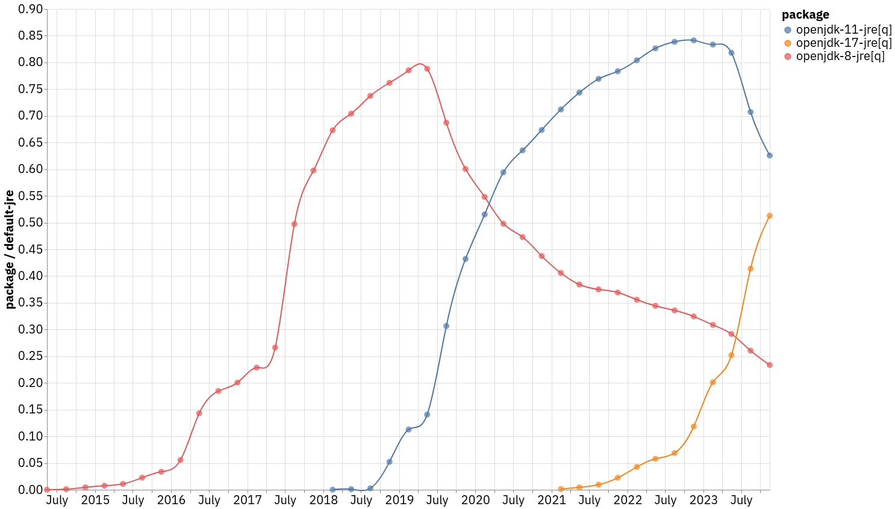

# Intro

This is a `clojure` script to plot [Debian Popularity
Contest](https://popcon.debian.org/) data. The difference to graphs from
<https://qa.debian.org/popcon.php> (e.g. for
[openjdk-17-jre](https://qa.debian.org/popcon-graph.php?packages=openjdk-17-jre))
is that the script will average number of installation over an interval (month,
quarter or year) and plot them normalized by a reference package.

For example, running command

    clojure -M:run/m -a q -r default-jre openjdk-8-jre openjdk-11-jre openjdk-17-jre

will produce the picture below where the installations of `openjdk-8-jre`,
`openjdk-11-jre` and `openjdk-17-jre` are normalized by installations of
`default-jre` package.

In the default configuration the numbers are averaged over month and the
reference package is `base-files`, but you can change it using command line
options.

You can also run unit tests with coverage report:

    clojure -M:test/kaocha

The same functionality implemented in `racket` can be found at
<https://salsa.debian.org/danilov/popcon-plot>.
